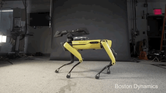

    <h1>Hi there! I am Abinesh Sankar!🤖👋🏽</h2>
    <h2>Welcome to my Github Repo!!</h2>

    

---

    
    
    
    
    
    
    

---

    I'm a curious developer. I learn new things everyday with the mindset that "there are concepts out there that I do not know yet!". I'm good at writing scripts and optimizing code for performance. I can create end to end single purpose applications in Python with ease. Currently exercising my brain with cloud concepts and implementation.

    

Still Working on my code contribution skills🥲

    

    

    

